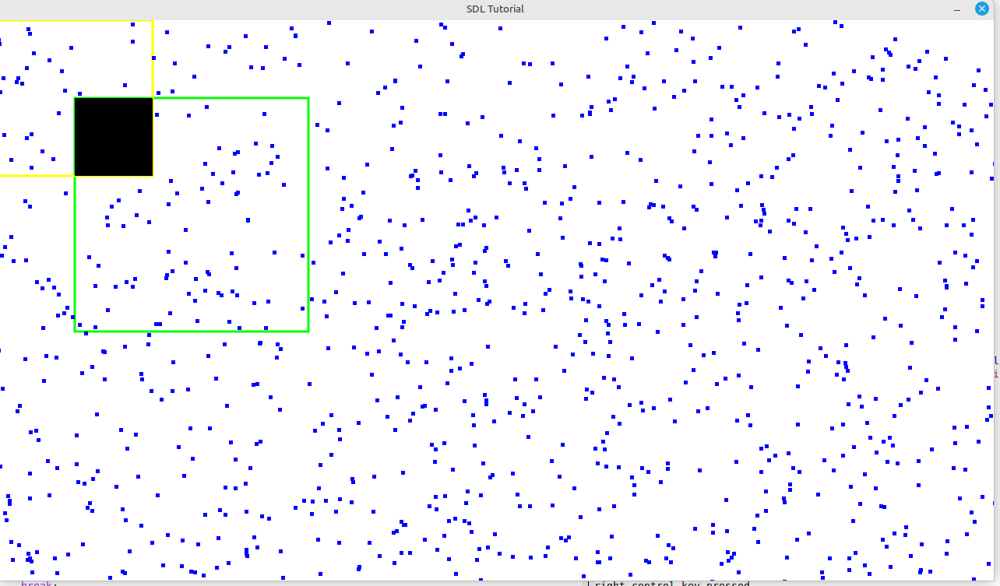

# Guile SDL2 Experiment 

## Emacs magit workflow

lots of .gitignore

s = stage file
u = unstage file

c c = commit changes { set title and explanation }
    then c c again
	
P u = push changes to remote origin/main	

## Macro constants 

```C
#define SDL_INIT_TIMER          0x00000001u
#define SDL_INIT_AUDIO          0x00000010u
#define SDL_INIT_VIDEO          0x00000020u  /**< SDL_INIT_VIDEO implies SDL_INIT_EVENTS */
#define SDL_INIT_JOYSTICK       0x00000200u  /**< SDL_INIT_JOYSTICK implies SDL_INIT_EVENTS */
#define SDL_INIT_HAPTIC         0x00001000u
#define SDL_INIT_GAMECONTROLLER 0x00002000u  /**< SDL_INIT_GAMECONTROLLER implies SDL_INIT_JOYSTICK */
#define SDL_INIT_EVENTS         0x00004000u
#define SDL_INIT_SENSOR         0x00008000u
#define SDL_INIT_NOPARACHUTE    0x00100000u  /**< compatibility; this flag is ignored. */
#define SDL_INIT_EVERYTHING ( \
                SDL_INIT_TIMER | SDL_INIT_AUDIO | SDL_INIT_VIDEO | SDL_INIT_EVENTS | \
                SDL_INIT_JOYSTICK | SDL_INIT_HAPTIC | SDL_INIT_GAMECONTROLLER | SDL_INIT_SENSOR \
            )
```

guile scheme uses ```#x``` prefix to denote a hexadecimal value 

logical or operator ```|``` in C is provided by guile logior function - logical inclusive or

```lisp
(define-module (graphics sdl2)
  #:export (*init-timer*
	    *init-audio*
	    *init-video*
	    *init-joystick*
	    *init-haptic*
	    *init-gamecontroller*
	    *init-events*
	    *init-sensor*
	    *init-parachute*
	    *init-everything*
	    sdl-init
	    sdl-quit))

(use-modules (system foreign-library)) ;; probably only need system foreign
(use-modules (system foreign))

(define *init-timer*             #x00000001)
(define *init-audio*             #x00000010)
(define *init-video*             #x00000020)
(define *init-joystick*          #x00000200)
(define *init-haptic*            #x00001000)
(define *init-gamecontroller*    #x00002000)
(define *init-events*            #x00004000)
(define *init-sensor*            #x00008000)
(define *init-parachute*         #x00100000)

;; guile uses logior to be logical inclusive or 
(define *init-everything*  (logior *init-timer*
				   *init-audio*
				   *init-video*
				   *init-events*
				   *init-joystick*
				   *init-haptic*
				   *init-gamecontroller*
				   *init-sensor*))

```

## C Procedures 

```c 
;; int SDL_Init(Uint32 flags);
;; void SDL_Quit(void);
```

the equivalent in guile 

``` lisp
(define sdl-init
  (foreign-library-function "libSDL2" "SDL_Init"
                            #:return-type int
                            #:arg-types (list uint32)))

(define sdl-quit
  (foreign-library-function "libSDL2" "SDL_Quit"
                            #:return-type void
                            #:arg-types (list)))
```

essentially in guile only need to worry about the type of integer passing in , 
anything else is a pointer and handled in guile using ```'*``` a quoted asterisk symbol 


## Learn all we ever wanted to know about FFI 

whole reason behind developing sdl2 backend was to see how to program guile foreign function interface

at moment almost completely done dynamically at load time through load-library ? well , we better check this 

guile FFI documentation is quite comprehensive if know where to look , and thats the problem , written for 
somebody who already knows how it works 

covered a fair amount of sdl2 to get a window up , some ttf font , some bitmap , some image to load png , 
this has generated a huge amount of constants which originally C macros that cannot be lifted using just
load-library.

C enums also are like C macros , they are not pulled in from load-library.

## guile module system 

just use define-module and know where to put the resulting scheme files 

on my machine 

```shell
> guile
> (%site-dir) 
$1 = "/opt/guile/share/guile/site/3.0"
```

here is quick example of macros/inc.scm file

```lisp
(define-module (macros inc)
  #:export (inc!
	    dec!
	    ))

(define-syntax inc!
  (syntax-rules ()
    ((_ x) (set! x (+ x 1)))
    ((_ x n) (set! x (+ x n)))))

;; (let ((x 1))(inc! x) x) => 2
;; (let ((x 1))(inc! x 2) x) => 3

(define-syntax dec!
  (syntax-rules ()
    ((_ x) (set! x (- x 1)))
    ((_ x n) (set! x (- x n)))))

;; (let ((x 1))(dec! x) x) => 0
;; (let ((x 1))(dec! x 2) x) => -1

```

two simple macros to mutate variable to increase or decrease its value 

```
/opt/guile/share/guile/site/3.0/macros/inc.scm
```

usage

```
> guile
> (use-modules (macros inc))
> (let ((x 1))(inc! x) x) ==> 2
```


### guile shared libraries

for limited shared libraries we create to give some absolutely essential features  

```
/opt/guile/lib/guile/3.0/extensions
```

# Graphical environment

simple text editor 

## unix less 

read contents of file

translate file into a vector of line strings 

append a series of lines together ? in a big string

sdl ttf to blit string onto string in one go

 

no cursor at moment

### lessons learnt

need small flexible procedures 

assuming ffi just crashes , almost no useful debug information there 

if it continues to work and does not leak memory - use htop to watch 

for configurability a guile coop server will be running in the main display loop 

if we redefine a procedure , cannot be visible to application user or take effect if that change is 

the entire display loop itself as it cannot replace what is already executing.

but if display loop calls out to a hypothetical display-line-numbers procedure say , 

then we could redefine display-line-numbers to do nothing  (ie no line numbers)

or redefine display-line-numbers to show absolute line numbering

or redefine display-line-numbers to show relative line numbering

### abstraction 

imagine have a colour display of a certain size , possibly multiple monitors , but lets get one monitor to work first

could have sdl backend or terminal console backend or opengl backend 

as far as i am concerned i just want to be able to put text on the screen

we may be more imaginative and imagine words or lines following a path draw by a little car drawn by user 

as car drives around it leaves words behind it like diesel smoke

### cursor(s)

how represent a cursor - usually its a bigger rectangle


### text itself

how representing the buffer internally ? 

### dired directory editor

maybe even just a directory listing - differentiate between a directory , a file and a symlink'd file

### language editor

true language editor 

### paredit 

system handles the parentheses for us 

### formatting

formatter takes care of how text is put on screen specifically just type and let the formatter do its job

### language implementation

what language is this editor being written in ? who cares . 

does it work ? it better . 

## unix editor 

One aspect of computing reliability is to use multiple languages

Suppose we have some solvable problem P

Language L we like to use , going to produce some data set that we wish to visualise

let call this Graphical Application G

```
P : L -> G
```

we can see output from program L on graphical window G

if we want to solve the problem in L2
```
P : L2 -> G
```

if we want to have a different graphical view / window G2

```
P : L2 -> G2
```

we could also

```
P : L -> G2
```

provided we have a consistent interface / data protocol

if we state what output file format should be from any such L , such that any such G can read it

we are free to choose specific languages L1 L2 L3 and build any such graphical viewing windows G1 G2 G3
from any graphical languages

also means should computing platform shift from 64bit to 128 bit then presumably the problem solver should
be able to cope ?

# Feedback loop

how would we provide a feedback loop to L ?

does this mean reprogramming L ? and then L2 L3 ... for every solver we wrote ?

what type of feedback is required / requested ?

# Guile Foreign Function Interface


Mainly about foreign-001 function interface

Experiment to see how far can go with dynamically loaded libraries in guile scheme using the
foreign function interface

 

Reality is that C code requires C compiler , requires to be in C to be properly programmed.

macros are simply vanished cannot be recovered , so these must be duplicated in scheme code somehow

so if following the "library" approach of foreign code and making guile the centre of the universe

we simply must give up on C macros.

Some things are much easier in C than from guile scheme , so sometimes an extra routine here and there
will help - this is the reason for libpixelformat .

that being said we followed some of the lazy foo game programming sdl2 tutorial and have quite a lot working

[ ] can we have a working cairo + sdl window ?

what does it mean to have the graphical user interface linked to the code itself ?

[ ] cambridge / oxford professor said gui code contaminates / poisons everything - provide links to research 


## 

Trying to do this from guile exclusively leads to significant problems.

1 - C macros do not exist after compilation , so cannot be loaded in dynamically in any shape or form

2 - due to (1) this means many routines are simply not available

3 - a C coded routine compiled as a shared library does not link against SDL libraries , therefore
depending on guile to find them dynamically at runtime which it simply cannot do

example IMG_Load not found by guile

Really just need to code entire application in C for performance reasons .

can then use libguile to extend application if needed

trying to navigate C datastructures from within guile is not easy

SDL_Surface *surface;
SDL_PixelFormat *pf = surface->format;

how does one actually do this in guile ?

know format member is at offset 8 from surface pointer , simply unable to decode this into guile.


## guile ffi sdl + cairo attempt
see the working code so far [here](guile-ffi-tutorial/foreign-library-001/test.scm)

## why

tried guile-sdl from david thompson and found i was getting several large memory leaks ,
also wanted to try to understand event loop in guile scheme


The scope of this repo is to make an SDL2 library that does not leak memory

tried using guile-3.0 to do this as a loadable shared library , but stalled on SDL_Init

suspect that SDL_Init is a C language macro which does not therefore generate a runtime symbol in the dynamic library

* also useful is to use CLANG compiler as it accepts compilation flags easier than the crusty GCC , also CLANG is likely to work
whereas GCC may be buggy , unless we can get hold of the german GCC with specific patches applied

## SDL2

david thompson [https://dthompson.us/projects/guile-sdl2.html] has a guile library for sdl2

from memory of using the library there is a memory leak issue which causes the computer system to eventually become unstable

it shows that sdl2 can be incorporated as a library , although on my initial attempts the c macro from SDL2/SDL.h namely SDL_Init

cannot be found

# other documentation


how or why to extend dia program

[https://www.gnu.org/software/guile/manual/html_node/Extending-Dia.html]

how to structure guile application to manipulate Dia program

[https://www.gnu.org/software/guile/manual/html_node/Dia-Structure.html]

Cairo-sdl contains 001-window is the most capable C example so far . 

Has almost full keyboard capability , outside of key combinations trapped by window manager.

Moving arrow keys controls a black box on the screen .

The are a number of square balls on the screen behave like bouncing balls as in pong game . 

Function keys understood , Shift , Control + Alt keys all understood left and right . 

In C there is an array of keys if key goes down , event is processed and that key id sets 1 in a big struct . 

when corresponding key is released , event is processed and that key id set to 0 again in the big struct.

## Truetype fonts 

Requires TTInit initialise TT routines 

what do if required font is missing ?


## Require Mouse Events 

Mouse coordinates mouse movement X Y , mouse enter , mouse leave , mouse drag , drag drop if possible be nice capability

## Cairo features

## Common lisp integration

## Guile scheme integration 

what FFI is to be supported ? 

## Guile drawing 

suppose want to be able to draw , then guile will have to have a main loop

be nice to have access to keyboard id's from guile , then we can tell what key is currently down , access to the 
entire structure 

## Guile Loop 1  - with corresponding COOP-REPL-SERVER

A loop - 

```
(define *myglobal* 5)

(define (loop)
	(format #t "myglobal has value ~a~%" *myglobal*)
	(coop-repl-server) ... 
	(loop)
```

## attached to running guile by guile-connect

then passing 

```
(set! *myglobal* 3)
```

should see corresponding change in original program , should now be printing 3 instead of 5 


set of increasing complex programs for very basic user interface

keyboard
mouse
rectangular graphics
bitmap images

lacks polygon colouring - aka cairo library no ffi in guile yet.


decided to explore SDL2 using C language as i think there are some memory leaks in guile SDL2 package

# SDL tutorial

sdl-tutorial directory contains C code experiments

# Cairo SDL tutorial

cairo has some nice shape functions to draw to screen 

## 001 Window

get a window on screen where we can do some SDL rectangle drawing and Cairo drawing 

essentially 32 bit colour screen , can do fullscreen also

cursor arrow keys move square rectangle around screen 

no timing so everything happens as fast as computer can handle , 
events are processed as recognised , otherwise ignored

does identify keyboard left right shift keys ,alt keys , control keys , f1 keys 
and keeps track if key is currently down or up - useful for emacs like key combinations

some key combinations are trapped by window manager , so that is a game loss to alt + tab

does not identify mouse enter , leave , mouse position yet, mouse right left middle clikcs

```
001-window : can we open a sdl2 cairo window and draw something onto screen with cairo 
 simplest proof of concept
```



besides that it seems fairly stable , no growing memory problems at the moment


# guile-sdl2-cairo
